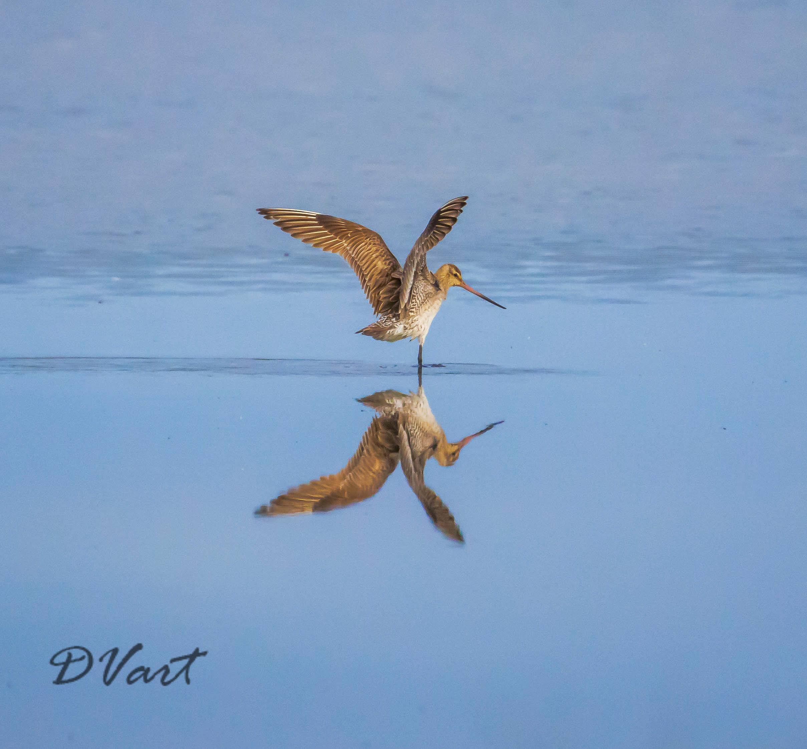
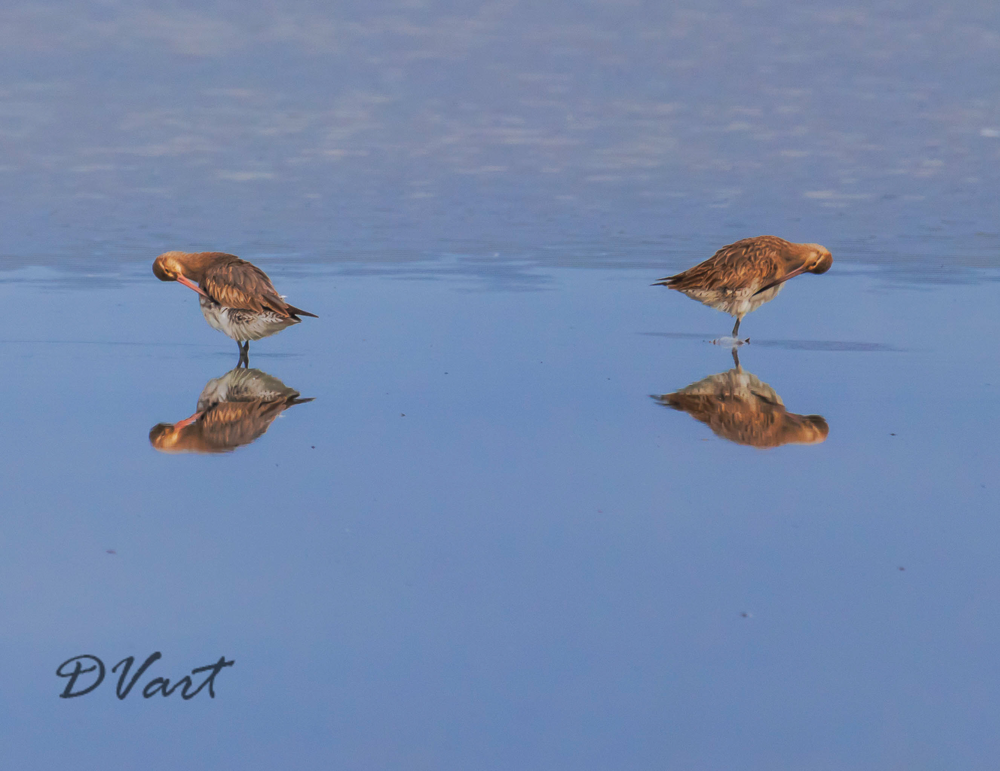

Bartailed Godwits at the Miranda Bird sanctuary the morning after their non stop flight from Alaska.  
We arrived at Miranda about 8am the morning after a large flock of Bar tailed Godwits arrived after their ten day non stop flight from Alaska.  Several of the birds in the flock had GPS trackers on them and the Miranda Sanctuary Facebook page updated birds progress to New Zealand.

I was very lucky to be standing next to the Miranda park ranger who had set up a high quality spotting scope.   The second piece of good luck that day was there was no wind and there was light soft cloud cover that was diffusing the beautiful orange morning sun.  
The ranger pointed out the various birds including a single Beared Turn who turned up a year ago and has not yet left.  
The ranger also explained how the Godwits can manipulate the shape of their beaks to obtain food down long narrow holes in the mud.  

The flock spent most of the time prenning , eating and resting.  I spotted the two birds in the image to the right prenning isolated from the main flock  .
I waited quite a while and took many shots to get this **one image** where the two birds beaks are facing each other and the Bartailed Godwits are mirrored in the water as well as mirror images of themselves.  
Click on the image to see the full size image.

