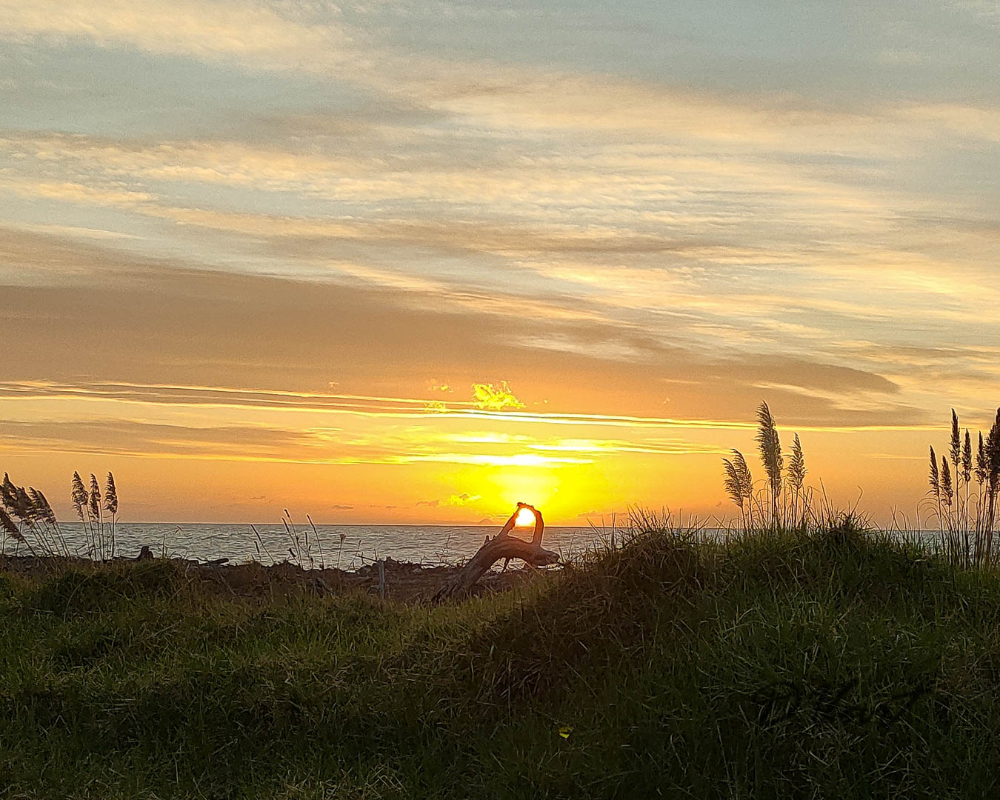
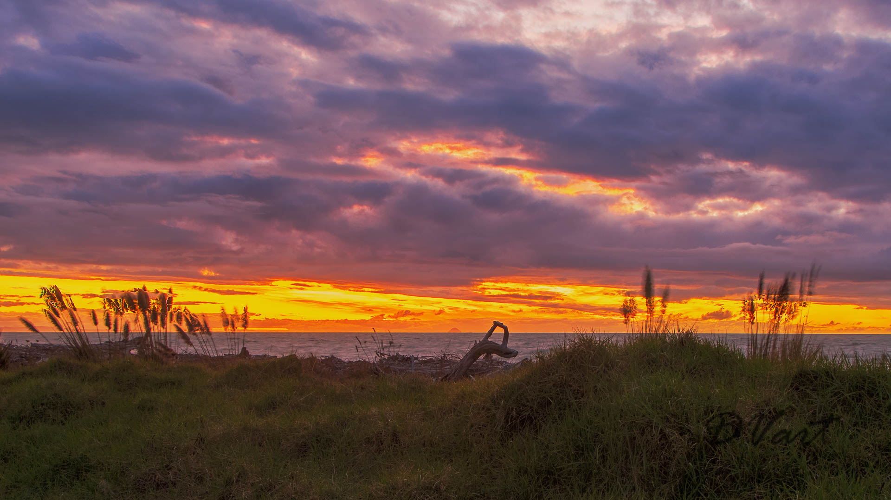

Some times the best and most memorable images are the result of being in the right place at the right time.  Not necessarily the result of good planning, camera gear or set up. 

On a recent trip away in the Campervan we stayed a few nights at a Park Over Property (POP) on the foreshore at Maraenui Bay, East Cape, New Zealand.  A POP is where a you can stay on a person's property for a small fee.  This POP was $20 per night for two people which included the use of the hot shower and toilet faciliteis thus reducing the load on van facilities.

As mentioned above this POP was on the foreshore facing west and north. There was a public walk way between the property and the beach. The first evening we walked the dog along this walk way just on sunset. I luckily had my phone with me but not my camera.  To the right is the image from the phone. This image was in JPG format and therefor did not capture all the raw data to allow post processing and also had quite and bit of noise.  How ever it did capture the moment the setting sun lined up with the loop in the drift wood log.
&nbsp;
&nbsp;    
         
I decided to return the next evening with my camera and tripod. I set up with plenty of time and positioned the tree loop to perfectly frame the setting sun.  

 
&nbsp;
The clouds had other ideas!  
&nbsp;
 Left is the best image I managed to get on that second visit. This image is a combination of three exposure bracketed images, how ever it missed the essential element of the sun in the drift wood loop.  So it missed the moment.  
 &nbsp;
It was still a very enjoyable walk and sunset to the naked eye.

&nbsp;
&nbsp;

